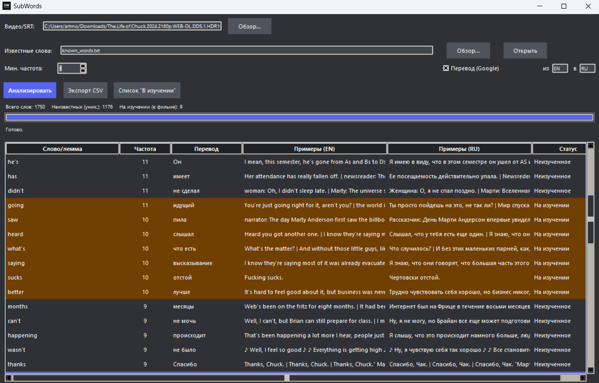

# SubWords

Windows Desktop приложение для изучения английского языка по субтитрам из фильмов. Приложение позволяет извлекать из видеофайлов субтитры для дальнейшего перевода отдельных слов с примерами.

## Возможности
- Можно выбрать видео или дорожку с субтитрами для анализа и изучения
- Возможность добавлять изученые слова в словарь или "принести такой словарь" самим для программы
- Слова также можно отправлять в изучение, если вы не уверены, выучили ли вы слово
- Возможность экспорта всех слов в CSV

